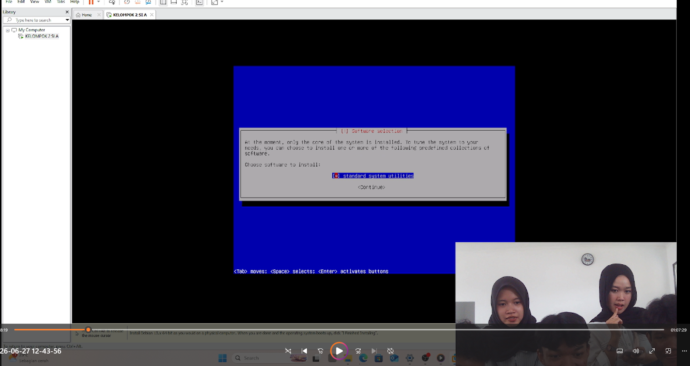
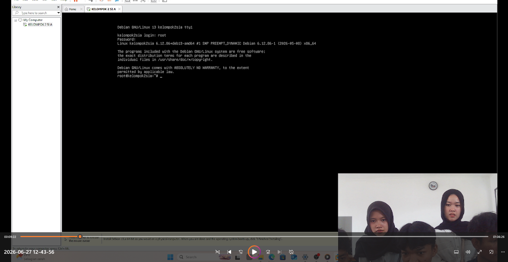
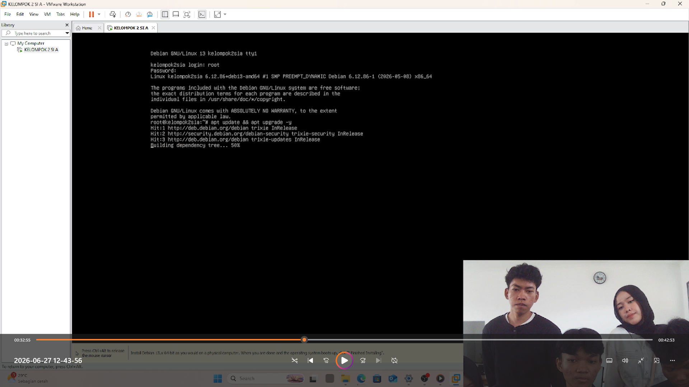
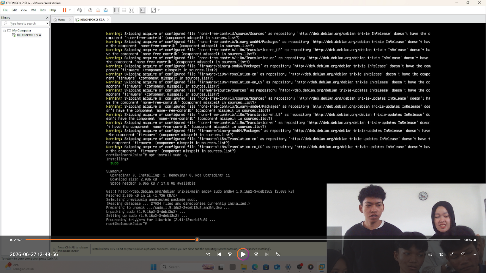
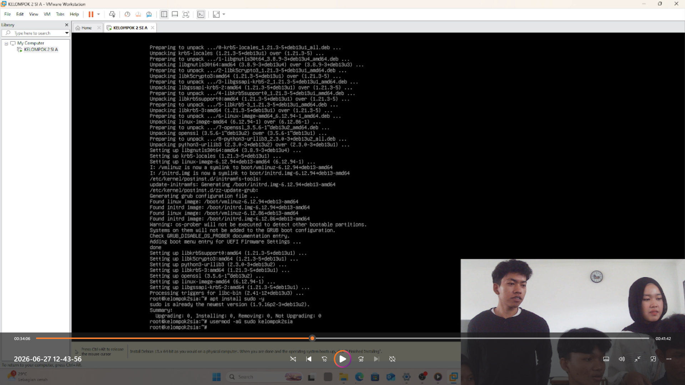
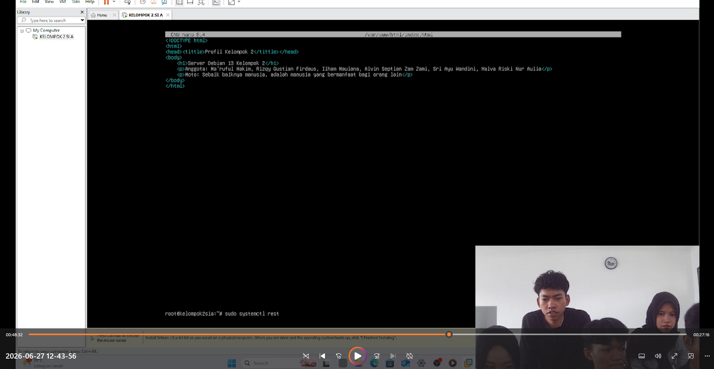
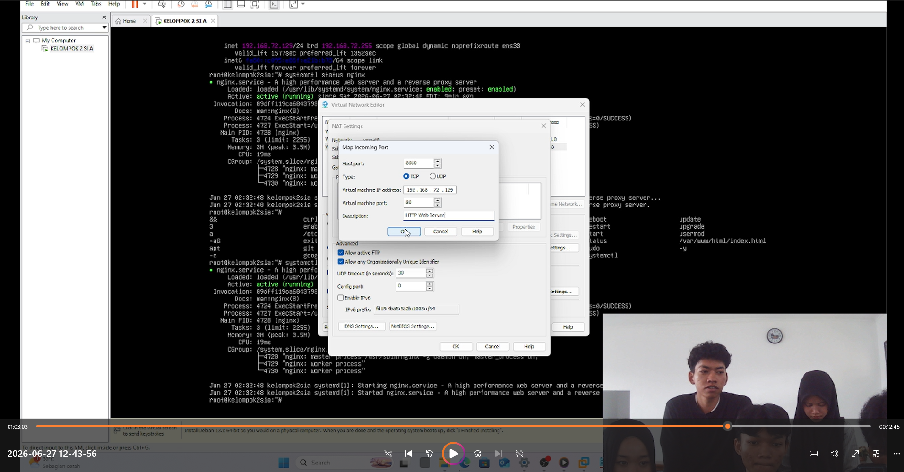
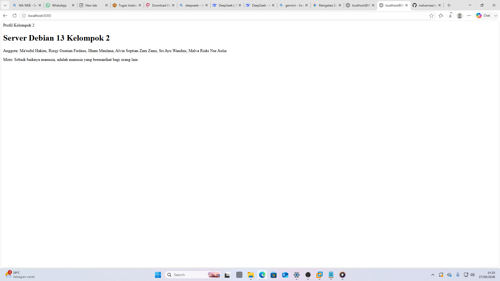

# sistem-operasi-si25-kelompok2
Tugas Instalasi Debian 13 Headless - Kelompok 2

# Tampilan Status Nginx Kelompok 2
Berikut adalah bukti bahwa Nginx telah berjalan aktif di server Debian kami:


# Laporan Tugas Kelompok: Instalasi Debian 13 Headless Web Server
Mata Kuliah: Sistem Operasi (SI-25)
Program Studi: Sistem Informasi, Universitas Galuh

## 👥 Anggota Kelompok 2 (Kelas SI-2025A)
1. [Ma'ruful Hakim] - [7020250014]
2. [Rizqy Gustian Firdaus] - [7020250004]
3. [Ilham Maulana] - [7020250022]
3. [Alvin Septian Zam Zami] - [7020250011]
3. [Sri Ayu Wandini] - [7020250019]
3. [Malva Riski Nur Aulia] - [7020250016]

## 🎯 Spesifikasi Lingkungan Server
* **Hypervisor:** VMware Workstation Pro
* **Sistem Operasi:** Debian 13 (Bookworm) - Headless (CLI / Tanpa GUI)
* **IP Address VM (Guest):** `192.168.72.129` (Gunakan perintah `ip a` pada antarmuka ens33 untuk melihat IP VM Anda)
* **Port Forwarding:** Host Port `8080` -> VM Port `80` (HTTP)

## 🛠️ Langkah-Langkah & Dokumentasi Praktikum

### 1. Instalasi Debian 13 Headless
* Melakukan instalasi sistem operasi Debian 13 mode teks dengan partisi guided (single partition).
* Mengatur hostname: `kelompok2sia` dan memasang bootloader GRUB ke `/dev/sda`.
* Memastikan hanya mencentang **SSH Server** dan **standard system utilities** pada tahap Software Selection.
* *[Tambahkan screenshot proses menu software selection di bawah ini]*
  

* *[Tambahkan screenshot tampilan login terminal Debian pertama kali di bawah ini]*
  

### 2. Konfigurasi User Sudo & Update Repositori
* Masuk sebagai user `root`, menginstal paket `sudo`, dan menambahkan user biasa ke grup sudo.
* Menjalankan pembaruan paket sistem dengan perintah:
  ```bash
  apt update && apt upgrade -y
  apt install sudo -y
  usermod -aG sudo [kelompok2sia]
  reboot
  ```
* *[Tambahkan screenshot hasil uji coba perintah sudo oleh user biasa di bawah ini]*
   *(Catatan: Hasil screenshoot "apt update && apt upgrade -y")*
   *(Catatan: Hasil screenshoot "install sudo...")*
   *(Catatan: Hasil screenshoot "usermood...)*

### 3. Instalasi Web Server Nginx & Tools Dasar
* Menginstal `net-tools`, `curl`, `git`, dan `nginx` menggunakan command line.
* Menjalankan dan mengaktifkan service Nginx agar berjalan otomatis saat booting.
  ```bash
  sudo apt install net-tools curl git nginx -y
  sudo systemctl start nginx
  sudo systemctl enable nginx
  ```
* *[Tambahkan screenshot status active running dari Nginx]*
  

### 4. Pembuatan Halaman Web Profil Kelompok
* Mengubah dokumen default Nginx pada `/var/www/html/index.html` dengan HTML profil anggota kelompok Anda.
* Melakukan restart web server untuk memuat perubahan.
  ```bash
  sudo systemctl restart nginx
  ```
* *[Tambahkan screenshot pengeditan index.html menggunakan nano editor]*
  

### 5. Konfigurasi Port Forwarding VMware & Pengujian Host
* Melakukan pemetaan port 8080 pada Windows Host ke port 80 Debian Guest VM lewat menu Virtual Network Editor.
* Menguji akses web server Debian melalui browser di sistem operasi host.
* *[Tambahkan screenshot pengaturan NAT Settings VMware]*
  
  
* *[Tambahkan screenshot halaman profil kelompok yang berhasil diakses dari browser host di http://localhost:8080]*
  

## 🎥 Link Video Demo
[Tonton Video Demo Pengerjaan Tugas Kelompok di YouTube / Google Drive](https://youtube.com/...)

## 📝 Kesimpulan
Berdasarkan praktikum yang telah dilakukan, dapat disimpulkan bahwa proses setup server Linux headless menggunakan Debian memberikan pemahaman tentang cara menginstal dan mengelola server tanpa menggunakan tampilan grafis (GUI). Seluruh proses dilakukan melalui terminal, mulai dari instalasi sistem operasi, konfigurasi jaringan, hingga pengaturan akses menggunakan SSH. Dengan metode ini, server menjadi lebih ringan, lebih efisien dalam penggunaan sumber daya, dan lebih mudah dikelola dari komputer lain melalui jaringan. Praktikum ini juga memberikan gambaran bagaimana proses dasar administrasi server Linux yang sering digunakan di dunia kerja.
Poin-poin Penting yang didapatkan
- Memahami cara instalasi Debian dalam mode headless tanpa desktop environment.
- Mengetahui langkah langkah konfigurasi dasar seperti pengaturan hostname, user, password, dan partisi disk
- Memahami cara menghubungkan server ke jaringan agar dapat diakses dari perangkat lain
- Belajar menggunakan SSH sebagai media untuk mengakses server dari jarak jauh
- Mengetahui pentingnya melakukan update sistem setelah instalasi menggunakan "apt update" dan "apt upgrade"
- Memahami penggunaan perintah dasar Linux melalui terminal, seperti mengelola file, folder, dan pengguna
- Mengetahui bahwa server tanpa GUI lebih ringan, lebih cepat, dan lebih cocok digunakan sebagai server karena tidak banyak menghabiskan resource
- Melatih kemampuan troubleshooting ketika terjadi kesahalan saat proses instalasi atau konfigurasi server
Secara keseluruhan, praktikum ini membantu memahami dasar-dasar administrasi server Linux dan memberikan pengalaman langsung dalam melakukan instalasi serta konfigurasi server berbasis Debian secara headless
